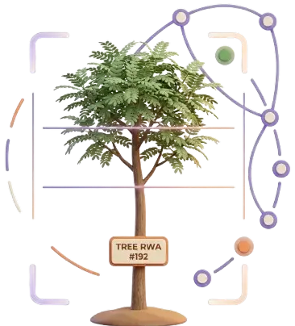
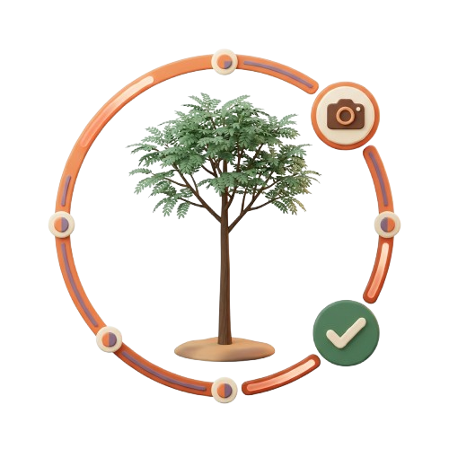
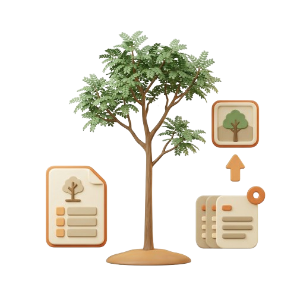
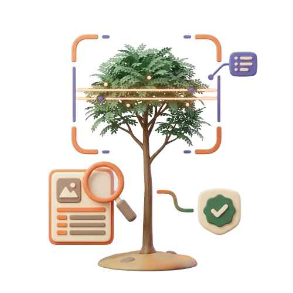
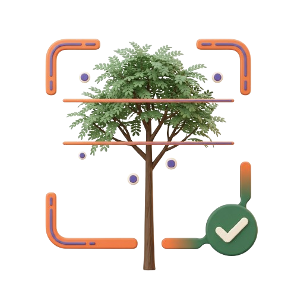

<div align="center">
  

  <h1>TreeBond AI</h1>
  <p><strong>Making Living Assets Verifiable On-Chain.</strong></p>

  <p>
    Every tree gets a verifiable digital identity — tracked from the ground,
    confirmed by AI, and recorded on-chain for good.
  </p>

  <p>
    
    
    
    
    
  </p>
</div>

<br />

<div align="center">
  
</div>

## What this is

TreeBond AI turns real trees into continuously monitored, independently
verified digital assets — connecting **sponsors**, field **operators**, and
**verifiers** around one living record of proof. A Tree RWA (an ERC-721 on
Arbitrum) represents verified sponsorship and monitoring history, not legal
land ownership — and no tree is tokenized until it has passed through AI
analysis *and* human verification.

| | |
|---|---|
|  | **Register** — an operator logs species, GPS, and an initial photo, creating a permanent identity before anything is claimed. |
|  | **Verify** — AI scores every submitted photo for health, growth, and anomaly risk; a human verifier reviews it before it goes near the chain. |
|  | **Tokenize** — only verified trees can be minted. Approval turns the tree into a traceable ERC-721 on Arbitrum Sepolia. |
|  | **Monitor** — every cycle adds a new evidence record, so a tree's status is never more than one cycle out of date. |

## Who it's for

<table>
<tr>
<td align="center" width="25%"><br /><b>Sponsors</b></td>
<td align="center" width="25%"><br /><b>Operators</b></td>
<td align="center" width="25%"><br /><b>Verifiers</b></td>
<td align="center" width="25%"><br /><b>Admins</b></td>
</tr>
<tr>
<td>Sponsor a real tree — by wallet or email — and track its verified growth from <code>/dashboard</code>.</td>
<td>Register projects and trees, upload monitoring evidence, build a verifiable history per hectare.</td>
<td>Review AI analysis against field evidence; approve or reject before anything reaches the blockchain.</td>
<td>Oversee users, projects, and disputes; grant on-chain roles from a connected wallet.</td>
</tr>
</table>

Sponsoring is wallet-first and login-free (connect, sign, done) — signing in
with that same wallet afterward claims whatever it already sponsored into a
single account dashboard, no separate linking step required.

## Infrastructure

<table>
<tr>
<td align="center" width="33%"><br /><b>Traceable</b><br /><sub>Every evidence upload and verification is recorded on-chain and open to independent inspection.</sub></td>
<td align="center" width="33%"><br /><b>Verifiable</b><br /><sub>No tree is tokenized without first passing AI analysis and human verification.</sub></td>
<td align="center" width="33%"><br /><b>Efficient</b><br /><sub>Runs on Arbitrum — fast, cheap verification for frequent monitoring cycles, not just one-time minting.</sub></td>
</tr>
</table>

## Tech stack

- **Framework** — Next.js 16 (App Router, Turbopack), React 19, TypeScript
- **Styling** — Tailwind CSS v4
- **Data** — MongoDB via Mongoose
- **Auth** — NextAuth v5: email/password *and* Sign-In with Ethereum (EIP-4361)
- **Chain** — wagmi + viem + RainbowKit, Arbitrum Sepolia
- **Storage** — IPFS via Pinata (operator photo uploads)
- **Lint/format** — Biome

### Smart contracts (Arbitrum Sepolia · chain `421614`)

| Contract | Responsibility | Address |
|---|---|---|
| `TreeRegistry` | Projects, trees, status lifecycle, metadata | [`0x80Bf…B38A`](https://sepolia.arbiscan.io/address/0x80Bf32F0cD043Df3F191fc2c712e5Ab76Bf7B38A) |
| `TreeNFT` | ERC-721 ownership — `tokenId` = `treeId` | [`0xEE07…71f`](https://sepolia.arbiscan.io/address/0xEE073d076cdB6Da047fAd2CD62e4d6EF0120F71f) |
| `TreeBond` | Sponsorship in native ETH, platform fee, operator payout | [`0x57A6…204f`](https://sepolia.arbiscan.io/address/0x57A60e3693f2846f4e7c9B0109c4EFE07135204f) |
| `VerificationRegistry` | On-chain verification records (hash + CID + scores) | [`0x5894…bC3A4`](https://sepolia.arbiscan.io/address/0x5894358cB440BBf2dC7b723696c648E384EbC3A4) |

Every write is signed from the caller's own connected wallet — there is no
server-held private key for anything a user does through the UI. The one
exception is the oracle, which pushes verification results from
`/api/oracle/submit-verification` and holds `ORACLE_ROLE` on
`VerificationRegistry`.

## Getting started

```bash
git clone https://github.com/ecorimbawa/treebond-ai.git
cd treebond-ai
npm install
cp .env.example .env.local   # fill in the values below
npm run dev
```

Open [http://localhost:3000](http://localhost:3000).

### Environment variables

| Variable | Purpose |
|---|---|
| `MONGODB_URI` | Connection string for the app's database |
| `AUTH_SECRET` | NextAuth session secret — `openssl rand -base64 32` |
| `NEXT_PUBLIC_CHAIN_ID` / `NEXT_PUBLIC_RPC_URL` | Arbitrum Sepolia chain + RPC |
| `NEXT_PUBLIC_WALLETCONNECT_PROJECT_ID` | RainbowKit / WalletConnect project id |
| `NEXT_PUBLIC_TREE_REGISTRY_ADDRESS`, `NEXT_PUBLIC_TREE_NFT_ADDRESS`, `NEXT_PUBLIC_TREE_BOND_ADDRESS`, `NEXT_PUBLIC_VERIFICATION_REGISTRY_ADDRESS` | Deployed contract addresses (see table above) |
| `NEXT_PUBLIC_IPFS_GATEWAY` | Gateway used to resolve `ipfs://` URIs for display |
| `IPFS_API_KEY` / `IPFS_API_SECRET` | Pinata classic API key — operator photo uploads. Left empty, uploads fall back to a placeholder CID; nothing is blocked |
| `AI_API_KEY` | Reserved for a real vision model — AI scores are currently entered by the operator alongside evidence |
| `ORACLE_PRIVATE_KEY` | Server-side signer holding `ORACLE_ROLE` on `VerificationRegistry` |

There is **no** `ADMIN_PRIVATE_KEY` — granting `OPERATOR_ROLE` / `VERIFIER_ROLE`
from `/admin` is signed by whichever wallet the admin connects in-browser,
the same pattern as every other write in the app.

### Useful scripts

Run any of these with `node scripts/<file>.mjs`.

| Script | What it does |
|---|---|
| `sync-contracts.mjs` | Regenerates typed ABIs + addresses after a contract redeploy |
| `seed-admin-user.mjs` | Creates a login-ready admin account |
| `seed-demo-data.mjs` | Seeds projects/trees so `/explore` isn't empty |
| `seed-pending-evidence.mjs` | Adds pending evidence so the verifier queue has something to review |
| `verify-chain.mjs` | Read-only health check — confirms the app's ABIs and addresses actually match what's deployed |
| `seed-chain.mjs` | Pushes one project + tree onto `TreeRegistry` end to end |
| `prepare-demo.mjs` | Makes every eligible seeded tree sponsorable on-chain in one pass — idempotent |
| `grant-role.mjs` | Grants/revokes an on-chain role from the deployer key, for when the in-app `/admin` form can't be used |
| `apply-tree-updates.mjs` | One-off content pass — species-matched cover photos, corrected location data |

## Project structure

```
app/
  (public)/     Landing page, tree explorer, public Tree Passport
  (auth)/       Login, create account — email or wallet (SIWE)
  (sponsor)/    Portfolio dashboard, linked wallets, account settings
  (operator)/   Project & tree registration, monitoring evidence upload
  (verifier)/   Review queue, approve/reject verification
  (admin)/      Users, projects, trees, disputes, on-chain role grants
  api/          Route handlers — mirrors the page groups above
components/     UI per route group, plus shared console/, auth/, tree/
hooks/          wagmi read/write hooks per contract function
lib/            db connection, IPFS, SIWE, tree-status mapping, web3 utils
models/         Mongoose schemas
contracts/      ABIs + addresses, generated by sync-contracts.mjs
scripts/        One-off setup, seeding, and verification scripts (above)
docs/           PRD, role journeys, gap analysis, frontend integration guide
```

## Docs

The `docs/` folder has more detail than belongs here: the full PRD, a
per-role journey walkthrough, a running gap analysis of what's implemented
vs. deferred, and the frontend↔contract integration guide.

---

<div align="center"><sub>Built on Arbitrum Sepolia Testnet</sub></div>
